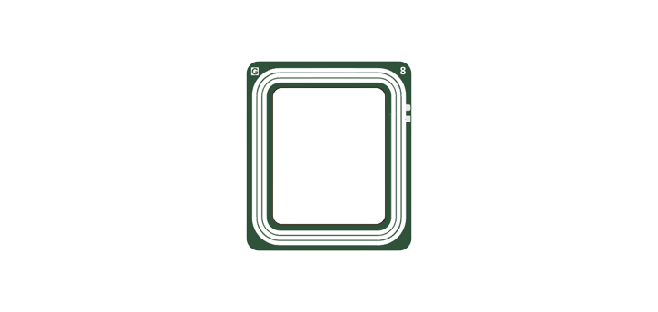

# Kampela coil PCB

We are using a separate coil PCB to put it as much closer to the smartphone antenna as possible. 
8 turns design shows better energy performance for harvesting energy for Kampela.

The coil PCB connects with the main PCB with 2 short copper wires. 