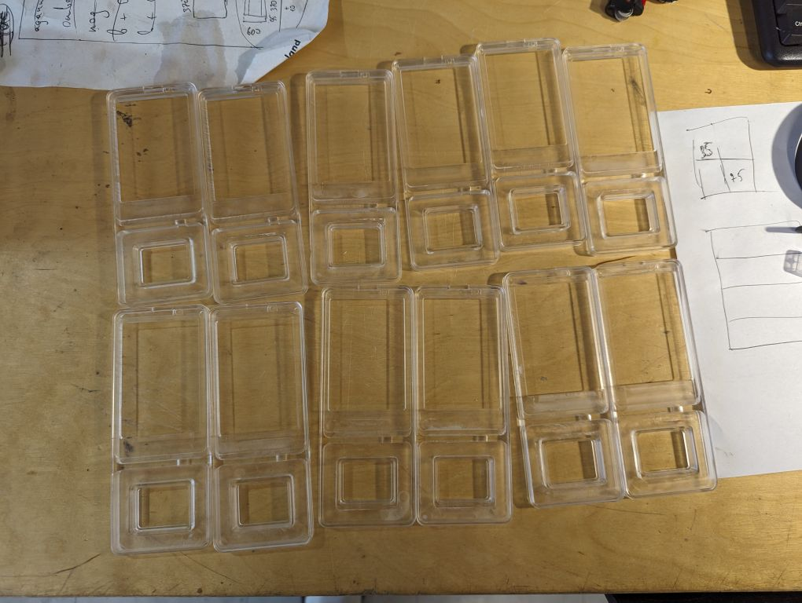

# Kampela coil PCB

For the Kampela G2 revision, we use a rigid transparent acrylic enclosure made on a CNC machine from an 8mm transparent acrylic sheet and pour it with 2 components of transparent polyurethane after full assembly and testing.

For devkits (green PCBs and full transparent) there is an 8pin connector on the bottom of the device to connect it to the Pilkki flash tool.

Under the screen, there is a place for an NFC tag working in pair with Kampela.

Before placing the PCBs and the screen - you should put a flexible glue contour to all holes contours and glue all the components during assembly. This glue prevents polyurethane pouring from leaking on the screen and inside the devkit connector.